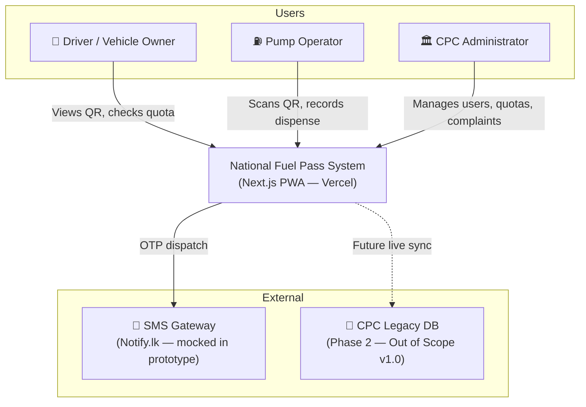
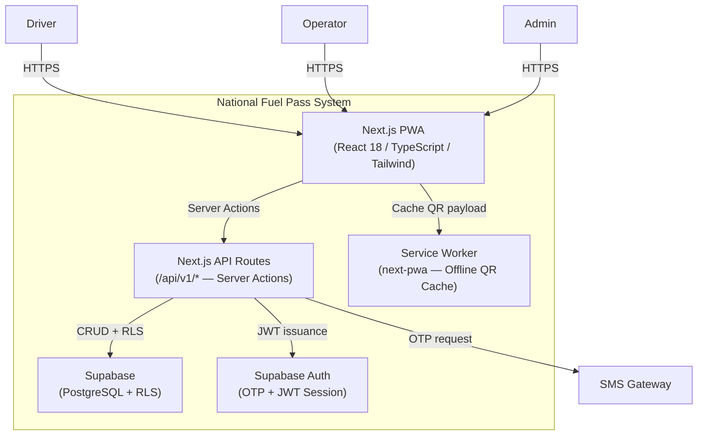
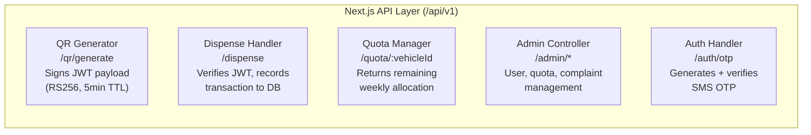
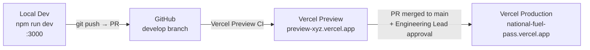

# System Architecture
## National Fuel Pass System — Redesign Proposal

---

| Field | Details |
|-------|---------|
| **Document ID** | NFP-001-ARCH |
| **Version** | 1.0 |
| **Status** | Draft |
| **Owner** | T2T Group D |
| **Last Updated** | 2026-09-10 |

---

## 1. System Context (C4 Level 1)

> Who uses the system and what external systems does it interact with?



---

## 2. Container Diagram (C4 Level 2)



---

## 3. Component Diagram — API Routes (C4 Level 3)



---

## 4. Key Design Decisions

| Decision | Choice | Rationale |
|----------|--------|-----------|
| Framework | Next.js 14 (App Router) | React ecosystem, SSR, Vercel-native, Server Actions |
| Styling | Tailwind CSS | Utility-first; rapid iteration on responsive layouts |
| Database | Supabase (PostgreSQL) | Open-source; Row Level Security; Auth built-in |
| Authentication | Supabase Auth + OTP | Serverless; OTP SMS support for low-literacy users |
| QR Generation | `qrcode.react` | Lightweight, React-native, well-maintained |
| QR Payload Security | Signed JWT (RS256) | TTL enforcement; prevents screenshot sharing abuse |
| PWA | `next-pwa` | Service Worker generation; offline QR caching |
| Form Validation | `zod` + `react-hook-form` | Type-safe schemas; real-time field validation |
| Deployment | Vercel | One-click deploy; Edge CDN; free tier for prototype |

---

## 5. Security Architecture

### 5.1 QR Code Trust Model

```
Driver App                    Backend API                   Operator App
────────────                  ─────────────                 ────────────
[Request QR] ────────────► [Sign JWT payload]
                              { vehicleUUID,
                                fuelType,
                                maxQuota,
                                iat, exp: +5min }
[Display QR] ◄─────────── [Return signed JWT]

                                                [Scan QR]
                                              [Decode JWT]
                              [Verify RS256 signature] ◄───────
                              [Check exp timestamp]
                              [Return vehicle data] ──────────► [Show DispenseForm]
```

### 5.2 Role-Based Access Control (RBAC)

| Role | Permissions |
|------|-------------|
| `DRIVER` | Read own vehicle data, own quota, own complaint history |
| `OPERATOR` | Scan QR, submit dispense transactions |
| `ADMIN` | Full read/write: all users, all quotas, all complaints, announcements |

*Enforced at Supabase RLS (PostgreSQL Row Level Security) + API route middleware.*

### 5.3 Data Privacy (PDPA Compliance)
- No PII (NIC, phone number) is ever embedded in QR payloads.
- Only non-identifiable `vehicleUUID` (internal UUID) is used in JWT payloads.
- All user PII stored encrypted at rest in Supabase.

---

## 6. Deployment Pipeline



---

## 7. ADR Index (Architecture Decision Records)

> Full ADR documents are in `docs/02_Technical/ADR/`

| ADR | Decision | Status |
|-----|----------|--------|
| ADR-001 | Use Next.js App Router over Pages Router | Accepted |
| ADR-002 | Use Supabase over custom PostgreSQL + Auth | Accepted |
| ADR-003 | JWT RS256 over HMAC for QR payloads | Proposed |

---

## Change Log

| Version | Date | Author | Change |
|---------|------|--------|--------|
| 1.0 | 2026-09-10 | T2T Group D | Initial architecture document |

---
*Document ID: NFP-001-ARCH | Standard: T2T Enterprise Documentation v1.0*
